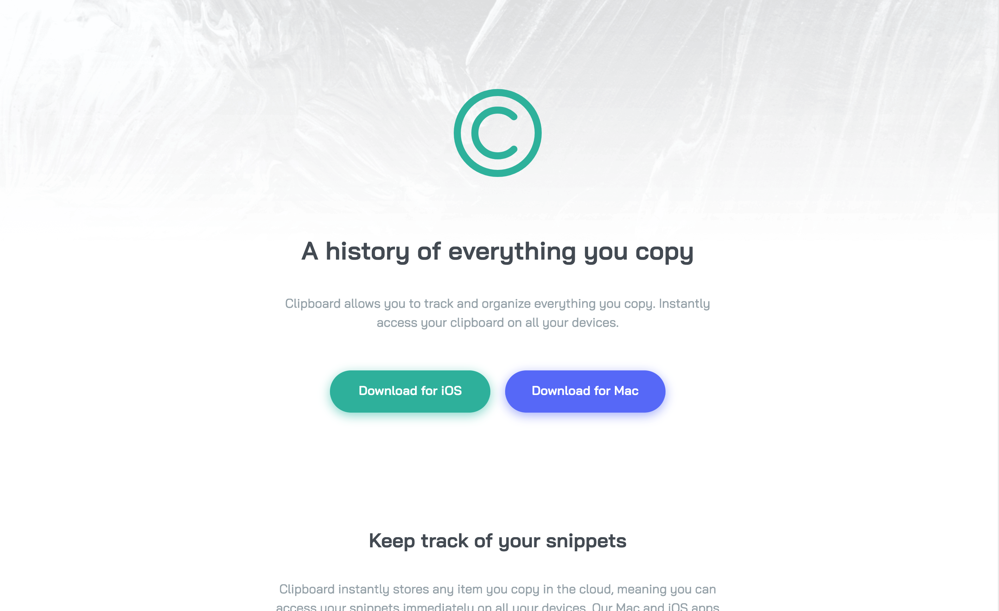

# Frontend Mentor - Clipboard landing page solution

This is a solution to the [Clipboard landing page challenge on Frontend Mentor](https://www.frontendmentor.io/challenges/clipboard-landing-page-5cc9bccd6c4c91111378ecb9). Frontend Mentor challenges help you improve your coding skills by building realistic projects. 

## Table of contents

- [Overview](#overview)
  - [The challenge](#the-challenge)
  - [Screenshot](#screenshot)
  - [Links](#links)
- [My process](#my-process)
  - [Built with](#built-with)
- [Author](#author)

## Overview

### The challenge

Users should be able to:

- View the optimal layout for the site depending on their device's screen size
- See hover states for all interactive elements on the page

### Screenshot

### Links

- Solution URL: [https://github.com/J-Rayln/fem-clipboard-landing-page](https://github.com/J-Rayln/fem-clipboard-landing-page)
- Live Site URL: [https://j-rayln.github.io/fem-clipboard-landing-page/](https://j-rayln.github.io/fem-clipboard-landing-page/)

## My process

### Built with

- Semantic HTML5 markup
- CSS custom properties
- Flexbox
- CSS Grid
- Mobile-first workflow
- [Andy Bell's 'A Modern CSS Reset'](https://piccalil.li/blog/a-modern-css-reset/) - This is a great reset that is well commented and isn't over the top.  Andy does a great job of explaining *why* we don't really need a huge reset anymore.  I find this one gets the job done 99% of the time.

## Author

- Github - [J-Rayln](https://github.com/J-Rayln)
- Frontend Mentor - [@J-Rayln](https://www.frontendmentor.io/profile/J-Rayln)
